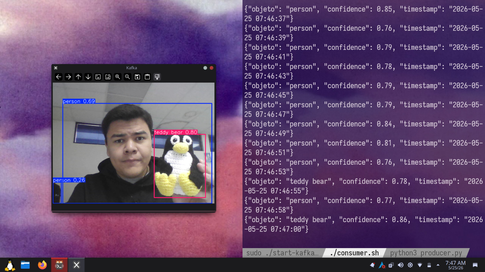
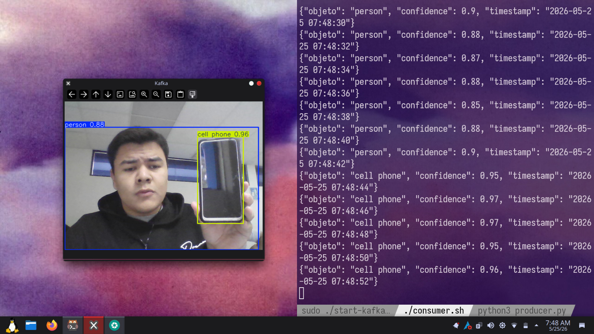

##  Demo del sistema

Aquí se muestran ejecuciones del programa en tiempo real:


Mi compañero santiago, no yo

el programa detectando un celular

## Kafka example

Sistema de detección de objetos en tiempo real usando:

- Python
- OpenCV
- YOLOv8
- Apache Kafka

## Arquitectura

Camara → YOLO → Kafka → Consumer

## Instalación

Instalar requirements:

pip install -r requirements.txt

## Ejecutar

```bash


./start-kafka.sh

## Crear topic
./topic.sh
Consumer
./consumer.sh
Producer
source venv/bin/activate
python producer.py
